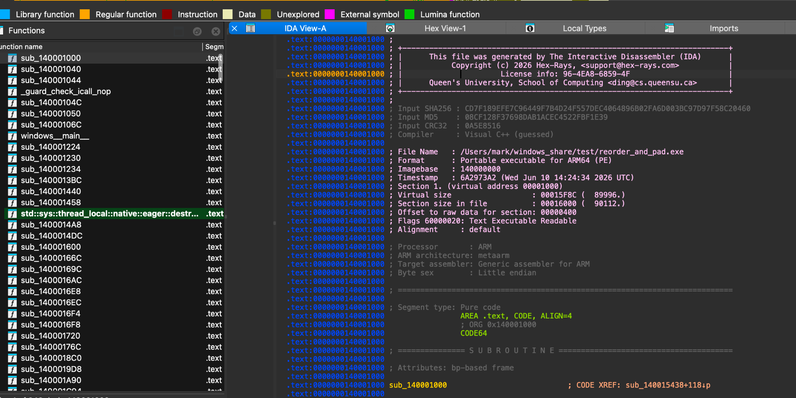
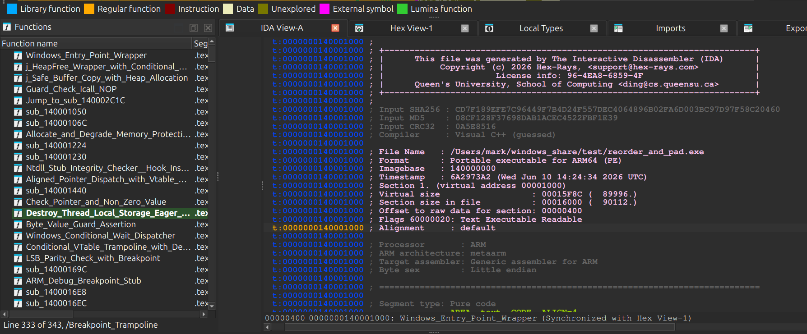
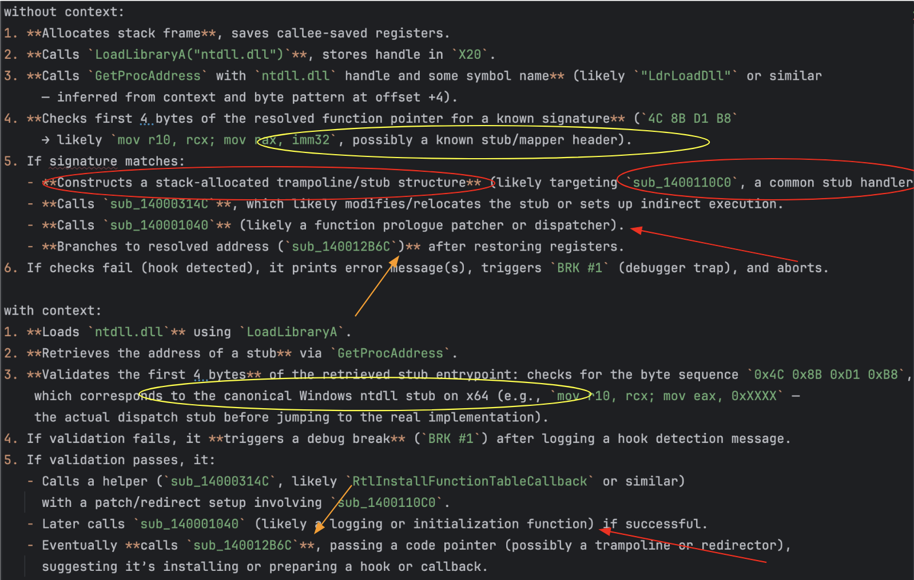

# IDA Annotator

This project provides a comprehensive workflow to extract a Control Flow Graph (CFG) from IDA Pro, 
process it using LLMs to generate high-level summaries and titles, and then re-import those annotations 
back into IDA for further analysis.

Turn this:


into this:


# Context leads to better summaries
Rather than feeding dissassembled code to LLMs, leading to hallucinations and inaccuracies, we first break
down the binary into a graph representation built from ida XRefs, call graph, and control flow graph.
Summaries are generated recursively, incorporating context from called functions and referenced data, 
leading to more accurate and useful results.

## Comparison

This image represents using the same prompts to generate summaries based on pure dissassembly text or using the graph context.



Red arrow - sub_140001040 is incorrectly guessed as a function dispatcher. With the added graph context it's correctly
identified as a logging function.

Orange arrow - sub_140012B6C is incorrectly stated to branch to the resolved address. With context it's identified as
installing a hook (it patches the address of the ntdll syscall into a syscall wrapper)

Yellow circle - with context the check is correctly identified as looking for the standard syscall setup on windows

Red circles - fully hallucinated


## Core Workflow

1.  **Extract CFG**: Extract the CFG and basic block instructions from an IDA database (.idb or .i64).
2.  **Pre-process**: Import the JSON data into a graph representation for pruning and normalization.
3.  **Summarize**: Generate function summaries by recursively incorporating information from connected nodes (called/referenced functions).
4.  **Condense**: Generate concise titles, one-liners, and "suspiciousness" scores from the full summaries.
5.  **Annotate**: Push the generated titles and summaries back into the IDA database as function names and comments.

## Setup

- Install dependencies via uv 
- IDA Pro (9.0+ for standalone extraction) with IDAPYTHON support.
- LLM configuration (API keys, endpoint, model selection) is handled via `src/llm_interface.py` or overridden by environment variables


## Project Structure

- `src/extract_cfg.py`: IDA Python script to be run inside IDA Pro.
- `src/extract_cfg_standalone.py`: Standalone Python script for direct database extraction.
- `src/summarize_graph.py`: Recursively summarizes functions using LLMs, incorporating context from dependencies.
- `src/name_and_condense.py`: Generates short titles and one-line summaries from full function descriptions.
- `src/annotate_ida_db.py`: IDA Python script to apply annotations back to the IDB.
- `src/visualize_cfg.py`: Utilities for graph loading, pruning (collapsing chains/thunks), and visualization preparation.
- `notebooks/`: Jupyter notebooks for interactive graph exploration and visualization with `ipysigma`.

## Usage

### 1. Extract CFG from IDA

You can extract the CFG directly from a database file on disk:

```bash
python3 -m src.extract_cfg_standalone your_database.i64
```
*Note: Requires `idapro` package and valid IDA license.*

This generates `your_database_cfg.json`.

### 2. Summarize Graph

Generate recursive summaries for all functions in the graph. This step uses an LLM to understand function behavior based on its instructions and the summaries of functions it calls.
This produces a `.jsonl` file (e.g., `function_summaries.jsonl`) containing name/summary pairs.
```bash
python3 -m src.summarize_graph
```

### 3. Generate Titles and One-liners

Condense the full summaries into human-readable titles and short descriptions.

```bash
python3 -m src.name_and_condense
```
This produces a `.jsonl` file (e.g., `function_titles.jsonl`) containing the original name, new title, and a one-line summary.

### 4. Annotate IDA Database

Load the results back into IDA Pro to assist your analysis.

1.  Open your database in IDA Pro.
2.  Go to **File -> Script file...** and select `src/annotate_ida_db.py`.
3.  In the IDA Python console, run:
    ```python
    annotate_all()
    ```
4.  Follow the prompts to select your full summaries JSON and the titles JSONL file.

This will:
- Rename functions based on the generated titles.
- Add full summaries as function comments.
- Add one-liners as comments at call sites.